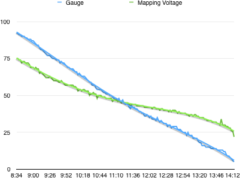

# pocketchip-batt

A lighter replacement for `pocketchip-batt` service and friends on PocketCHIP.

The original one was running a relatively heavy shell script (`/usr/sbin/battery.sh`) outputting many 
battery-related parameters in order to grep only 2 (voltage and charging status) and put them into 
two files that were later used by other scripts and even the default home screen program.

It would not be an issue on a desktop system but here it was running often enough to cause audio to stutter 
in some programs, for example, `VisualBoyAdvance`.

A little C program in this repo can be used instead of `pocketchip-batt` service, so the battery level indicator 
on the home screen and the usual battery warnings still work with lesser penalty to the CPU resources. 
It is also easier on your flash drive, because the folder where voltage/charging status files are placed now 
live in `/run`, which is supposed to be RAM disk. 

The program also replaces 3 related systemd services (`pocketchip-off00`, `pocketchip-war05` and `pocketchip-warn15`) 
that were checking the battery levels and then calling those power notification scrips.

In addition to that the newer version of the script replaces the functionality of the `pocketchip-load` service, 
which was responsible for proper X key mapping on startup and display backlight deactivation when the system was 
turning the display off.  

Another improvement here is that the service reads "fuel gauge" register from the battery controller and places its 
value (in percents) to `/usr/lib/pocketchip-batt/gauge` along `voltage` and `charging` files. This allows to know 
battery level with much better precision than linearly mapping the current voltage into the min/max range 
(something the home screen does). 

Here is the comparison of fuel gauge reading (blue) vs the value calculated by linearly mapping the voltage into 
the min/max range (green). The Pocket CHIP was left sitting and running the same fairly heavy program, 
i.e. the load was more or less constant.

Since nobody needs the real voltage and because fuel gauge is so much better I've decided to stop reading 
the actual voltage and use the fuel gauge to calculate "virtual" voltage which after mapping by the home screen will
become a fuel gauge effectively improving the battery indicator.

`ubihealthd` causes additional stutter on 4.4, this appears to be due to excessive logging.
The modified ubihealthd.service lowers the logging level and increases niceness of the process,
mitigating the random audio stutter further.

## Installation

(If you have the older version of the script, then first uninstall it using the original sources.)

Make sure you have git and gcc installed, then clone the repo and build/install it: 

	sudo apt-get install libx11-dev libxtst-dev
	git clone https://github.com/aleh/pocketchip-batt.git
	cd pocketchip-batt
	sudo make install

Please reboot the device just in case. Enjoy!

## Removal

If you want to undo the changes:

	sudo make uninstall

## TODO

 - `pocket-home` appears to be constantly consuming up to 1-4% of CPU, must be polling something fairly hard, would be great to patch it. 
   I've personallly moved to JWM, see my config [here](https://github.com/aleh/pocketchip-jwmrc).

 - we should patch `rsyslogd.conf` with our Makefile as described [here](https://www.raspberrypi.org/forums/viewtopic.php?f=63&t=134971#p898539);

 - the emulator itself can be improved to sync audio a bit nicer, [here is my attempt](https://github.com/aleh/VisualBoyAdvance). 

---
